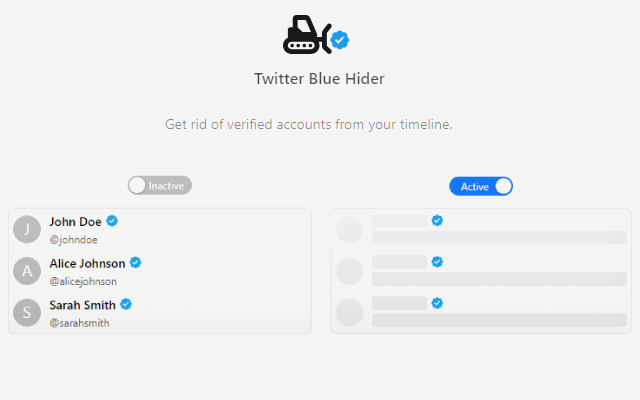

# Twitter Blue Hider

Chrome extension that helps you hide Twitter verified accounts.

## Features

- Automatically hides tweets from verified accounts
- Shows compact cards instead of hidden tweets
- Toggle visibility of hidden tweet cards
- Auto-cleans hidden tweet data after 2 hours
- Works with infinite scroll
- Matches Twitter's theme
- Privacy focused - all data stays in your browser
- Easy to use settings
- Smart position preservation while scrolling

## Usage

1. Visit Twitter (twitter.com)
2. Verified account tweets will be automatically hidden
3. Click on the hidden tweet cards to reveal them
4. Use the extension popup to:
   - Toggle the extension on/off
   - Show/hide replacement cards
   - View currently hidden tweets
   - Clear stored data

## Privacy Policy

Our privacy policy can be found at: [PRIVACY_POLICY.md](PRIVACY_POLICY.md) or [here](https://buraketmen.github.io/twitter-blue-hider/)

## License

This project is licensed under the MIT License.
